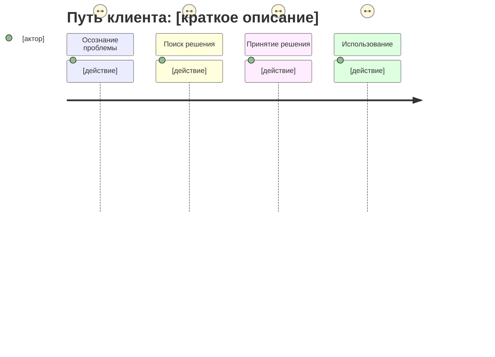

# JTBD Interview Analyzer

Проанализируй транскрипт интервью по методологии Jobs To Be Done и Mom Test (Rob Fitzpatrick).

---

## ЧАСТЬ 1: ПРОФИЛЬ РЕСПОНДЕНТА

### Кто говорит
- **Роль/должность:**
- **Контекст:** (компания, индустрия, размер)
- **Релевантность:** насколько это наш целевой сегмент (1-10)
- **Стадия:** Passive Looking / Active Looking / Deciding / First-time Use / Ongoing Use

---

## ЧАСТЬ 2: TIMELINE (хронология решения)

Восстанови путь респондента от проблемы к решению. Это ключевой артефакт JTBD.

### First Thought (Первая мысль)
> Когда впервые подумал, что нужно что-то менять?
- **Когда:**
- **Что случилось:**
- **Цитата:**

### Event #1 (Событие, запустившее поиск)
> Что стало триггером активного поиска?
- **Когда:**
- **Что случилось:**
- **Push факторы:** (что отталкивало от текущего решения)
- **Цитата:**

### Event #2 (Поиск и оценка)
> Как искал альтернативы? Что сравнивал?
- **Когда:**
- **Что рассматривал:**
- **Pull факторы:** (что привлекало в новом решении)
- **Цитата:**

### The Switch (Момент переключения)
> Когда и где принял решение?
- **Когда:**
- **Где находился:**
- **Что стало решающим:**
- **Цитата:**

### Anxieties & Habits (Что мешало переключиться)
- **Тревоги:** (страхи относительно нового)
- **Привычки:** (что держало в старом)
- **Как преодолел:**

---

## ЧАСТЬ 3: JOBS TO BE DONE

### Функциональная работа
> "Когда я [ситуация], я хочу [действие], чтобы [результат]"
```
Когда я __________,
я хочу __________,
чтобы __________.
```

### Эмоциональная работа
> Как хочет себя чувствовать?
-

### Социальная работа
> Как хочет выглядеть перед другими?
-

### Ожидаемые результаты (Desired Outcomes)
| # | Направление | Метрика | Цитата |
|---|-------------|---------|--------|
| 1 | Minimize/Maximize | время/деньги/усилия на... | "..." |
| 2 | | | |
| 3 | | | |

---

## ЧАСТЬ 4: FORCES DIAGRAM

```
                    ПЕРЕКЛЮЧЕНИЕ
                         ^
                         |
    PUSH                 |                 PULL
    (от старого)         |         (к новому)
    ─────────────────────┼─────────────────────>
    • [фактор 1]         |         • [фактор 1]
    • [фактор 2]         |         • [фактор 2]
                         |
                         |
    HABITS               |              ANXIETIES
    (держат в старом)    |        (страхи нового)
    ─────────────────────┼─────────────────────>
    • [привычка 1]       |         • [тревога 1]
    • [привычка 2]       |         • [тревога 2]
                         |
                         v
                    ОСТАТЬСЯ
```

**Баланс сил:** Push+Pull > Habits+Anxieties? (Да/Нет/Пограничный)

---

## ЧАСТЬ 5: CUSTOMER JOURNEY MAP

### Mermaid диаграмма



### Табличный формат CJM

| Этап | Действия | Мысли | Эмоции | Боли | Возможности |
|------|----------|-------|--------|------|-------------|
| Осознание | | | | | |
| Поиск | | | | | |
| Оценка | | | | | |
| Решение | | | | | |
| Покупка | | | | | |
| Первый опыт | | | | | |
| Регулярное использование | | | | | |

### Формат для Google Docs (копируй как есть)

```
CUSTOMER JOURNEY MAP
Респондент: [имя/роль]
Дата интервью: [дата]

ЭТАП 1: ОСОЗНАНИЕ ПРОБЛЕМЫ
• Действия:
• Мысли:
• Эмоции:
• Боли:
• Возможности для продукта:

ЭТАП 2: ПОИСК РЕШЕНИЯ
• Действия:
• Мысли:
• Эмоции:
• Боли:
• Возможности для продукта:

[продолжить для остальных этапов]
```

---

## ЧАСТЬ 6: АУДИТ ИНТЕРВЬЮ (Mom Test)

### Нарушения правил Mom Test

| # | Тип ошибки | Цитата интервьюера | Почему плохо | Как исправить |
|---|------------|-------------------|--------------|---------------|
| 1 | | | | |
| 2 | | | | |

**Типы ошибок для поиска:**
- **Pitching** — рассказ о своём продукте/идее вместо вопросов
- **Leading question** — наводящий вопрос ("Вам же важна скорость, да?")
- **Hypothetical** — вопрос о будущем ("Вы бы купили...?")
- **Compliment fishing** — поиск похвалы ("Как вам наша идея?")
- **Fluff acceptance** — принятие общих фраз ("Это было бы круто")
- **Premature solution** — обсуждение решения до понимания проблемы
- **Closed questions** — вопросы да/нет вместо открытых
- **Interruption** — перебивание респондента

### Упущенные возможности

| # | Момент в интервью | Что можно было спросить | Почему важно |
|---|-------------------|------------------------|--------------|
| 1 | | | |
| 2 | | | |

**Типы упущенных возможностей:**
- Не уточнили конкретику ("Расскажите подробнее...")
- Не спросили про деньги/время/ресурсы
- Не копнули в эмоции ("Что вы почувствовали?")
- Не попросили пример из жизни
- Не спросили "Почему?" (правило 5 почему)
- Не уточнили контекст ("Где вы были? С кем?")

### Оценка качества интервью

| Критерий | Оценка (1-5) | Комментарий |
|----------|--------------|-------------|
| Фокус на прошлом (не будущем) | | |
| Конкретика (не общие фразы) | | |
| Открытые вопросы | | |
| Глубина (follow-up вопросы) | | |
| Отсутствие питчинга | | |
| Эмоциональный контекст | | |
| Timeline восстановлен | | |
| **ИТОГО** | /35 | |

---

## ЧАСТЬ 7: ИНСАЙТЫ

### Главные находки

1. **Инсайт:**
   - Цитата:
   - Импликация для продукта:

2. **Инсайт:**
   - Цитата:
   - Импликация для продукта:

3. **Инсайт:**
   - Цитата:
   - Импликация для продукта:

### Что подтвердилось
-

### Что опровергнуто
-

### Что неожиданно
-

---

## ЧАСТЬ 8: УЛУЧШЕНИЯ СКРИПТА

### Вопросы, которые стоит добавить

```
1. [Новый вопрос]
   Зачем: [что узнаем]

2. [Новый вопрос]
   Зачем: [что узнаем]

3. [Новый вопрос]
   Зачем: [что узнаем]
```

### Вопросы, которые стоит убрать/переформулировать

| Было | Стало | Почему |
|------|-------|--------|
| | | |

### Рекомендованная структура следующего интервью

```
INTRO (2 мин)
- Представление, цель, запись

КОНТЕКСТ (5 мин)
- [вопрос 1]
- [вопрос 2]

TIMELINE (15 мин)
- [вопрос про First Thought]
- [вопрос про Trigger Event]
- [вопрос про Switch Moment]

FORCES (10 мин)
- [вопрос про Push]
- [вопрос про Pull]
- [вопрос про Anxieties]
- [вопрос про Habits]

OUTCOMES (5 мин)
- [вопрос про ожидания]
- [вопрос про метрики успеха]

WRAP-UP (3 мин)
- Есть ли кто-то ещё, с кем стоит поговорить?
- Что я не спросил, но должен был?
```

---

## ЧАСТЬ 9: СЛЕДУЮЩИЕ ШАГИ

### Гипотезы для проверки
- [ ]
- [ ]

### Вопросы для следующих интервью
-
-

### Сегменты для глубокого изучения
-

---

---

## ЧАСТЬ 10: МАППИНГ НА JTBD CANVAS РУДЕНКО (если вызван с флагом --rudenko)

Если в $ARGUMENTS есть `--rudenko` или скилл вызван из `/l-cx-rudenko` — добавь эту секцию.

Транслируй результаты анализа в формат 9 секций JTBD Canvas Руденко:

| # | Секция Руденко | Откуда брать |
|---|---|---|
| 1 | Формулировка работы | ЧАСТЬ 3: Функциональная работа → "Когда я..., хочу..., чтобы..." |
| 2 | Метрики работы | ЧАСТЬ 3: Desired Outcomes (направление + метрика) |
| 3 | Push-драйверы | ЧАСТЬ 4: Forces → PUSH факторы |
| 4 | Pull-драйверы | ЧАСТЬ 4: Forces → PULL факторы |
| 5 | Привычки (якоря) | ЧАСТЬ 4: Forces → HABITS |
| 6 | Барьеры переключения | ЧАСТЬ 2: Anxieties & Habits → как преодолел |
| 7 | Страхи перед новым | ЧАСТЬ 4: Forces → ANXIETIES |
| 8 | Тревоги прошлого опыта | ЧАСТЬ 2: Timeline → Event #1 (негативный триггер) |
| 9 | Интерпретаторы | ЧАСТЬ 2: Event #2 → что рассматривал (альтернативы из других рынков) |

**Мотивационный конфликт (формулировка для ДКЦП):**
> "Хочу [Pull + функциональная работа], но не могу из-за [Habits + Anxieties + барьеры]"

---

## Для передачи в l-cx-rudenko

Если результаты этого анализа будут использоваться в `/l-cx-rudenko`, верни компактный блок:

```
### Из l-t-jtbd → для ДКЦП

**Мотивационный конфликт:** "Хочу [X], но не могу из-за [Y]"
**Функциональная работа:** [глагол + объект + контекст]
**Метрики работы:** [как клиент оценивает]
**Push:** [1], [2]
**Pull:** [1], [2]
**Привычки:** [1], [2]
**Страхи:** [1], [2]
**Интерпретаторы:** [альтернативы]
**Баланс сил:** [Push+Pull > или < Habits+Anxieties]
```

---

## Failure Modes

| Ситуация | Поведение |
|----------|-----------|
| Транскрипт < 5 минут | Пропусти CJM (ЧАСТЬ 5) и аудит (ЧАСТЬ 6). Сфокусируйся на JTBD + Forces. Предупреди: "Короткий транскрипт — анализ неполный." |
| Респондент — не целевой сегмент (релевантность < 3) | Скажи прямо. Всё равно заполни, но отметь: "Данные от нецелевого сегмента — гипотезы, не факты." |
| Интервьюер только питчил, вопросов почти нет | Заполни аудит (ЧАСТЬ 6), покажи все нарушения Mom Test. JTBD и Forces будут спекулятивными — отметь это. |
| Нет момента переключения (The Switch) | Респондент ещё не переключился → заполни Push/Anxieties/Habits, но отметь: "Решение не принято. Сильные Habits/Anxieties." |
| Групповое интервью (несколько голосов) | Раздели на отдельные профили. Forces diagram — для каждого отдельно. |

---

**Транскрипт интервью:**

$ARGUMENTS
