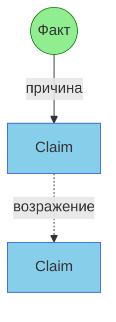
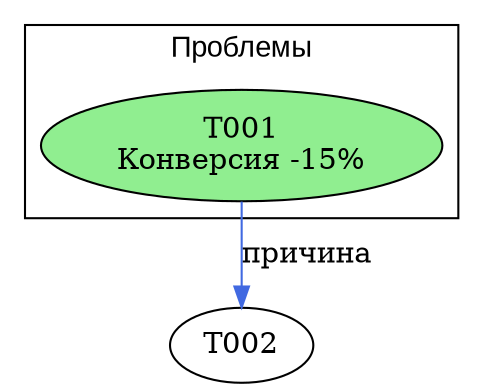

# Скилл: Извлечение тезисов из транскриптов (v2)

Извлекай ВСЕ тезисы из транскрипта, кластеризуй их по темам, построй граф связей и создай нарративное описание каждой ветки дискуссии.

## Входные данные

Пользователь предоставляет:
- Транскрипт встречи/звонка/интервью/лекции
- Или путь к файлу с транскриптом

## Сохранение результатов

**ОБЯЗАТЕЛЬНО:** Результаты оформляются в markdown-файл и сохраняются в хранилище.

### Алгоритм выбора места

1. **Предложи место** на основе контекста транскрипта:
   - Встреча по проекту → `10-CLAUDE/{project}/`
   - Интервью/исследование → `05-ПРОЕКТЫ/{project}/research/`
   - Лекция/обучение → `03-ОБУЧЕНИЕ/`
   - Стратегические обсуждения → `07-PERSONAL/Я/`
   - Неясный контекст → `00-INBOX/`

2. **Формат имени файла:** `YYYY-MM-DD_thesis_{краткое-название}.md`

3. **Спроси подтверждение:**
   > Предлагаю сохранить в: `{путь}`
   >
   > Согласен или укажи другое место?

4. **Дождись ответа** перед сохранением. Не сохраняй без явного согласия.

### Структура выходного файла

```markdown
---
type: thesis-extraction
source: "{название транскрипта}"
date: YYYY-MM-DD
participants: [список]
total_theses: N
clusters: M
---

# Анализ: {название}

[Содержимое анализа]
```

## Двухуровневая система формулировок

| Уровень | Назначение | Формат |
|---------|------------|--------|
| **L3** (полный) | Понимание контекста | Карточка с тезисом + контекст + обоснование + альтернативы |
| **L4** (компактный) | Диаграммы и визуализации | `[ЧТО] — [ПОЧЕМУ]` (15-20 слов) |

---

## Шаг 1: Извлечение тезисов (L3 — полные карточки)

### Формат карточки тезиса

```
### [T001] ТИП | Спикер

**Тезис:** Полная самодостаточная формулировка, понятная без контекста.

**Контекст:** В ответ на что сказано / какую проблему решает

**Обоснование:** Почему так / аргументация спикера

**Отвергнутые альтернативы:** Что НЕ так (если обсуждалось)

**Цитата:** "Прямая цитата из транскрипта" (опционально)
```

### Типы тезисов

| Маркер | Тип | Описание |
|--------|-----|----------|
| `▣ ФАКТ` | Факт/данные | Объективная информация, цифры |
| `◉ CLAIM` | Утверждение | Мнение, оценка, позиция |
| `? ВОПРОС` | Вопрос | Запрос информации |
| `💡 ИДЕЯ` | Идея | Предложение, гипотеза |
| `✓ РЕШЕНИЕ` | Решение | Договорённость |
| `⚡ ПРОБЛЕМА` | Проблема | Препятствие, блокер |

### Правила извлечения

1. **Полнота**: извлекай ВСЁ, даже мелкие реплики со смыслом
2. **Самодостаточность**: каждый тезис понятен БЕЗ транскрипта
3. **Атрибуция**: всегда указывай спикера
4. **Нумерация**: сквозная T001, T002...
5. **Без интерпретации**: записывай что сказано, не что "имелось в виду"

---

## Шаг 2: Компактные формулировки (L4)

После создания L3 карточек — сгенерируй L4 для диаграмм:

```
[ЧТО утверждается] — [ПОЧЕМУ / на основании чего]
```

**Правила L4:**
- Начинай с сути (что утверждается)
- После тире — причина или контраст
- Избегай местоимений ("это", "оно")
- Максимум 15-20 слов

### Таблица соответствия L3 → L4

| ID | L4 (для диаграмм) |
|----|-------------------|
| T001 | [компактная формулировка] |
| T002 | [компактная формулировка] |

---

## Шаг 3: Кластеризация по темам

Сгруппируй тезисы в тематические кластеры.

### Дерево навигации (в начале документа)

```
# НАВИГАЦИЯ ПО ТЕМАМ

1. [КЛАСТЕР A](#кластер-a) (12 тезисов)
   1.1. [Подтема A1](#подтема-a1) (5)
   1.2. [Подтема A2](#подтема-a2) (7)
2. [КЛАСТЕР B](#кластер-b) (8 тезисов)
...
```

---

## Шаг 4: Нарратив кластера

**КРИТИЧЕСКИ ВАЖНО:** Для каждого кластера — связное описание развития дискуссии.

### Формат

```markdown
### Нарратив: [Название кластера]

Дискуссия началась с [T001], когда Speaker A отметил, что...
Это вызвало вопрос [T003] о том, как...
Speaker B предложил [T005], однако Speaker C возразил [T007]...

В результате группа пришла к [T012] — решению о том, что...
```

### Требования к нарративу

1. **Связность**: читается как история
2. **Ссылки**: каждое утверждение подкреплено [Txxx]
3. **Динамика**: кто что сказал, кто возразил, к чему пришли
4. **Развязка**: решение / открытый вопрос / конфликт

---

## Шаг 5: Граф связей

### Типы связей (рёбра)

| Символ | Тип связи | Описание |
|--------|-----------|----------|
| `──▶` | Причина → Следствие | A приводит к B |
| `══▶` | Поддержка | B усиливает A |
| `──✕──` | Возражение | B оспаривает A |
| `══✕══` | Конфликт | A и B несовместимы |
| `···▶` | Уточнение | B конкретизирует A |
| `--▷` | Развитие | B расширяет A |
| `~~▶` | Пример | B иллюстрирует A |
| `◇──◇` | Альтернатива | B — другой вариант A |
| `?──▶` | Вопрос → Ответ | B отвечает на A |

### Цвета узлов

- Зелёный = Факт
- Синий = Утверждение
- Жёлтый = Вопрос
- Фиолетовый = Идея
- Оранжевый = Решение
- Красный = Проблема

### Цвета рёбер

- Зелёный = Поддержка, развитие
- Красный = Возражение, конфликт
- Синий = Причина → следствие
- Серый = Уточнение, пример

---

## Шаг 6: Визуализация

### Псевдографика (по умолчанию)

```
┌─────────────────────────────────────────────────────────┐
│  КЛАСТЕР: [Название темы]                               │
├─────────────────────────────────────────────────────────┤
│   ┌────────────────────────┐                           │
│   │ T001 ФАКТ              │                           │
│   │ [L4 формулировка]      │───▶───┐                   │
│   └────────────────────────┘       │                   │
│          │══▶                      ▼                   │
│   ┌────────────────────────┐ ┌────────────────────────┐│
│   │ T002 ИДЕЯ              │ │ T003 CLAIM             ││
│   │ [L4 формулировка]      │ │ [L4 формулировка]      ││
│   └────────────────────────┘ └────────────────────────┘│
└─────────────────────────────────────────────────────────┘
```

### Mermaid (для GitHub/Notion)



**Стратегии для больших графов:**
- ≤30 тезисов → одна диаграмма с subgraph
- 31-100 → отдельные диаграммы по кластерам
- 100+ → сокращённые ID + таблицы расшифровки

### GraphViz/DOT (для больших графов)



### Flying Logic (для причинно-следственного анализа)

Сгенерируй JSON для генератора:

```json
{
  "title": "Анализ встречи",
  "domain": "conversation",
  "nodes": [
    {"id": "T001", "title": "L4 текст", "class": "fact", "annotation": "Спикер: A"}
  ],
  "edges": [
    {"source": "T001", "target": "T002", "annotation": "причина"}
  ],
  "groups": [
    {"id": "G1", "title": "Кластер: Проблемы", "members": ["T001", "T002"]}
  ]
}
```

---

## Формат выходного документа

```markdown
# Анализ транскрипта: [Название/дата]

## Метаданные
- Участники: [список]
- Всего тезисов: [N]
- Кластеров: [M]

---

## НАВИГАЦИЯ ПО ТЕМАМ
[Дерево со ссылками]

---

## ПОЛНЫЙ КАТАЛОГ ТЕЗИСОВ (L3)
[Все карточки тезисов]

---

## ТАБЛИЦА L3 → L4
| ID | Тип | Спикер | L4 (для диаграмм) |
|----|-----|--------|-------------------|

---

## КЛАСТЕР 1: [Название]

### Нарратив
[Связное описание развития дискуссии]

### Тезисы кластера
[Список ID с L4 формулировками]

### Карта связей
[Псевдографика или Mermaid]

---

## МЕЖКЛАСТЕРНЫЕ СВЯЗИ
[Связи между кластерами]

---

## СВОДКА

### Нерешённые вопросы
[Тезисы типа "ВОПРОС" без ответов]

### Конфликты
[Пары тезисов с конфликтом]

### Принятые решения
[Тезисы типа "РЕШЕНИЕ"]

### Ключевые инсайты
[3-5 главных выводов]
```

---

## Чек-лист качества

- [ ] Каждый тезис имеет полную карточку L3
- [ ] Каждый тезис имеет компактную версию L4
- [ ] L4 понятна без контекста (нет "это", "оно", "там")
- [ ] Каждый кластер имеет нарратив со ссылками
- [ ] Нарратив показывает ДИНАМИКУ (кто → что → кто возразил → итог)
- [ ] Все диаграммы используют L4 формулировки
- [ ] Решения и открытые вопросы выделены

---

## Выбор формата визуализации

| Сценарий | Формат |
|----------|--------|
| Быстрый просмотр в чате | Псевдографика |
| GitHub, Notion | Mermaid |
| Причинно-следственный анализ | Flying Logic |
| Большой граф (100+ узлов) | GraphViz |

Спроси пользователя, какой формат предпочтительнее.
